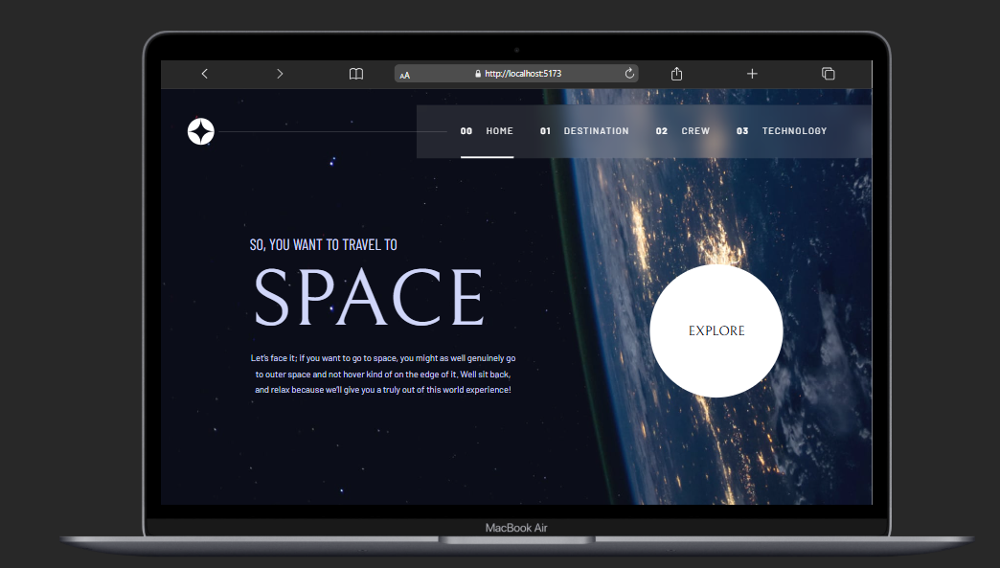

# Space Tourism Website

A responsive web app built as part of the Frontend Mentor Space Tourism challenge where uers can explore destinations, crew, and technology.



---

### The challenge

Users should be able to:

- View the optimal layout for each of the website's pages depending on their device's screen size
- See hover states for all interactive elements on the page
- View each page and be able to toggle between the tabs to see new information

## ✨ Features

- Responsive design for mobile, tablet, and desktop
- Multi-page navigation: Home, Destination, Crew, Technology
- Dynamic content loaded from a local JSON file using fetch (crew, destinations, technology)
- Smooth transitions and modern layout with active/hover states

## 🛠️ Built With

- **React**
- **React Router**
- **TypeScript**
- **Tailwind CSS**
- **Framer motion**
- **Vite**

## Links

- Frontend mentor challenge
- View [Live](https://space-tour-pi.vercel.app/)
- View [code](https://github.com/Ejiro-Frances/space_tourism.git)

## Getting Started

### Prerequisites

- Node.js (v18+ recommended)
- or npm/yarn

### Installation

```bash
# Clone the repo
git clone https://github.com/Ejiro-Frances/space_tourism.git

# Navigate to project folder
cd space_tourism

# Install dependencies
  npm install
# or
yarn install

 # Run it locally
 npm run dev
# or
yarn dev

#  Then open http://localhost:5173/ (or the port shown in terminal).


#### Build for Production
npm run build

```

## Project Structure

space_tourism/
├── public/
| ├── crew/ # Images
| ├── destination/ # Images
| ├── home/ # Images
| ├── shared/ # Images
| ├── technology/ # Images
| └── data.json
├── src/
│ ├── components/
| ├── ui/
| ├── crewtab.tsx
| ├── destinationtab.tsx
| ├── header.tsx
| └── techtab.tsx
│ ├── lib/
│ ├── pages/
│ ├── types/
| ├── App.tsx
| ├── index.css
│ ├── main.tsx
│ └── vite-env.d.ts
├── components.json
├── eslint.config.js
├── index.html
├── package-lock.json
├── package.json
├── README.md
├── tsconfig.app.json
├── tsconfig.json
├── tsconfig.node.json
└── vite.config.ts

### Acknowledgement

Design inspired by Frontend Mentor - [Space Tourism](https://www.frontendmentor.io/challenges/space-tourism-multipage-website-gRWj1URZ3)

# License

This project is open source and available under the MIT License.
